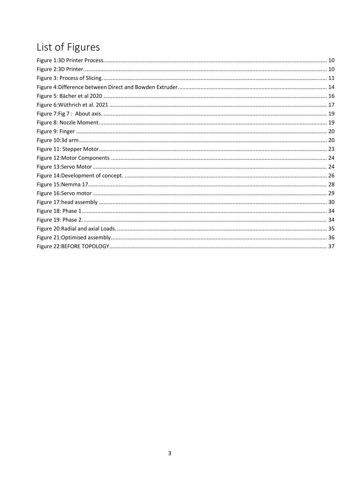
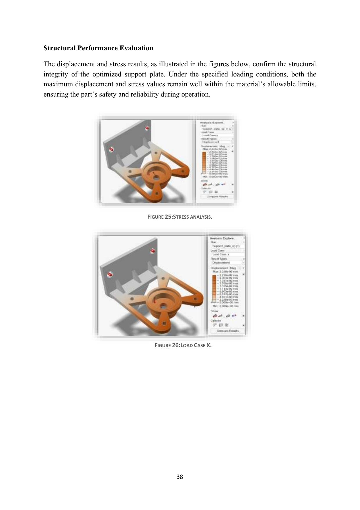
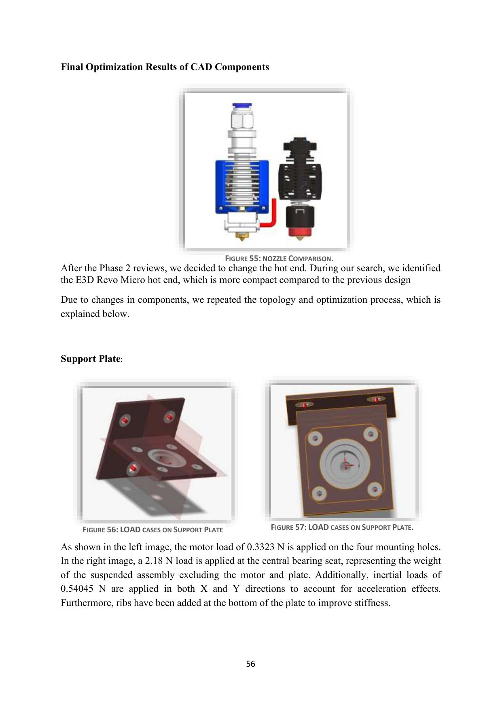
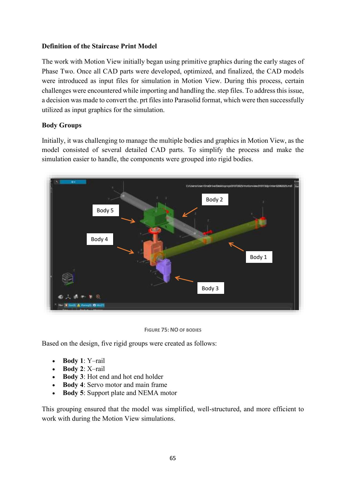
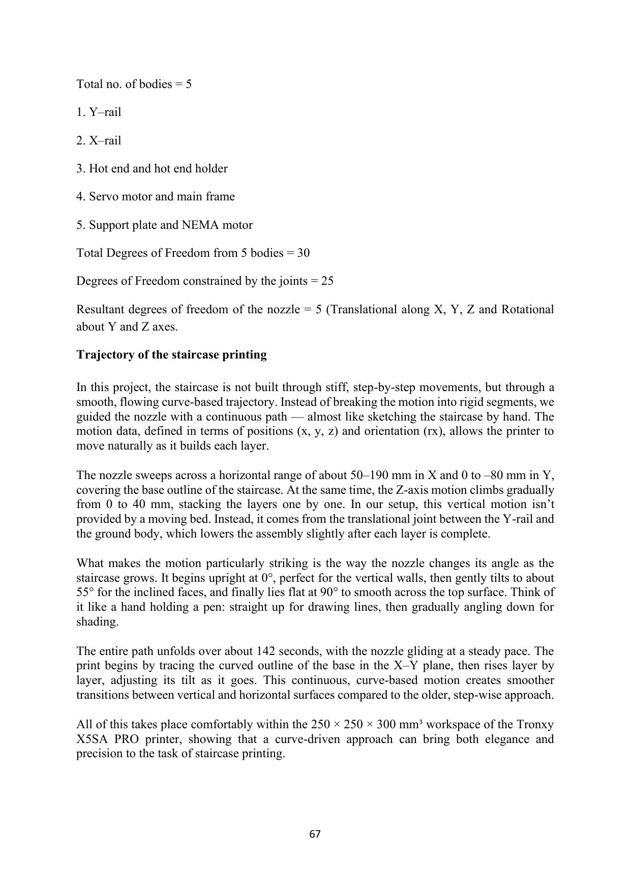

# Finger Printer — Multi-Axis Gimbal Printhead for FDM 3D Printing

*Virtual Product Development (VPD) module — MSc Mechanical Engineering / Mechatronics, Hochschule Kaiserslautern (Summer Semester 2025)*
*Supervised by Prof. Dr.-Ing. Thomas Kilb, Prof. Dr.-Ing. Matthias R. Leiner, and Dipl.-Ing. (FH) Arina Engels*



## Team — Group B

- Mithin Kumar Chithirala
- **Madana Gopala Reddy Konda**
- Yuvraj Ramchandra Labhade
- Vinay Kumar Pepeti

This was a 4-person collaborative project completed over one semester. The CAD, simulation, and documentation below reflect the team's combined work; my individual contribution is detailed below, sourced directly from the team's signed contribution declaration in the final report.

## My Role — Multi-Body Simulation Lead

| Workstream | My Contribution |
|---|---|
| **Multi-Body Simulation (MBS)** | **43%** — team lead |
| **CAD Design** | 30% — second-highest on the team |
| Initial Concept Design | 25% |
| Topology Optimization | 20% |
| Documentation | 16% |
| **Overall project contribution** | **26.8%** |

I led the kinematic and motion simulation work in Altair MotionView — degrees-of-freedom analysis, joint torque validation, and trajectory generation for the two toolpaths described below — and was the second-largest contributor to the CAD modeling in Siemens NX.

## Overview

The Finger Printer is a custom multi-axis gimbal end-effector designed to retrofit a Tronxy X5SA Pro FDM 3D printer, giving it the ability to print overhangs and undercuts that a standard fixed-nozzle printer can only produce with support material — support structures that can account for up to 40% wasted material on complex geometries. The project ran across three structured phases: concept & research, structural optimization, and final validation.

## Phase 1 — Concept & Research

- Surveyed FDM fundamentals, direct-vs-Bowden extrusion, and existing multi-axis/gimbal-nozzle printing approaches
- Defined functional and design-space requirements and a make-vs-buy procurement strategy
- Selected the actuation hardware: a NEMA 17 stepper motor and a DS3218 PRO servo motor

## Phase 2 — Structural Optimization



- Added a DN625 bearing to absorb radial and axial loads and reduce loading on the motor
- Ran topology optimization in Altair Inspire to lighten and stiffen the frame, eliminating flex observed during initial testing

## Phase 3 — Final Validation



**Kinematics:** modeled as 5 rigid bodies (Y-rail, X-rail, hotend + holder, servo + main frame, support plate + NEMA motor) with 30 total degrees of freedom, 25 constrained by joints, leaving **5 resultant DOF at the nozzle** — 3 translational (X, Y, Z) and 2 rotational (about Y and Z).



**Motion simulation (Altair MotionView):** validated two toolpaths — a smooth, curve-based staircase trajectory and a spiral vase toolpath for free-form overhangs.



**Torque validation:** peak torque on the upper stepper measured 0.029 Nm against a 0.15 Nm capacity; peak torque on the lower servo measured 0.019 Nm against a 2.3 Nm capacity — confirming both motors were sized correctly for the load, with headroom to spare.

## Tech Stack

Siemens NX · Altair Inspire · Altair MotionView · Topology Optimization · Multi-Body Dynamics (MBS) · Kinematic Chain Analysis · Additive Manufacturing / FDM

## Repository Contents

```
finger-printer-vpd/
├── README.md
├── media/                              → key figures referenced above
└── docs/
    ├── Phase1_VPD.pdf                  → Phase 1 presentation
    ├── Phase2_VPD.pdf                  → Phase 2 presentation
    ├── Phase3_VPD.pdf                  → Phase 3 presentation
    └── Final_Report_Finger_Printer.pdf → full 87-page report (methodology, calculations, literature review)
```
